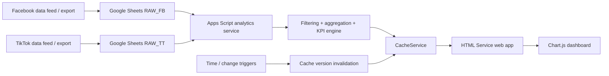

# Automated Media Analytics Dashboard

A **Google Apps Script analytics web app** that turns normalized Facebook and TikTok campaign data in Google Sheets into an interactive, automatically refreshed performance dashboard.

> **Portfolio edition.** This repository is a sanitized reimplementation of a real working analytics project. Client names, raw campaign data, internal sheet names, credentials, and proprietary upstream ingestion logic are intentionally excluded. The included demo data is synthetic.

## Why I built it

Media performance reporting was fragmented across platforms and required repetitive aggregation before stakeholders could compare spend, reach, efficiency, video performance, and creative results. I built an Apps Script layer that standardizes the reporting logic, calculates consistent KPIs, caches repeated queries, and serves an interactive dashboard directly from a Google Sheet-backed web app.

## What the project demonstrates

- **Data transformation:** maps two different platform schemas into a consistent analytics model.
- **Business analytics:** calculates CPM, CTR, CPC, CPE, VTR, cost-per-view, cost-per-message, cost-per-like, CPF, platform share, and period-over-period deltas.
- **Automation:** scheduled refresh and cache invalidation through installable Apps Script triggers.
- **Performance engineering:** script-level response caching reduces repeated full-sheet aggregation.
- **Web development:** Apps Script HTML Service + JavaScript + Chart.js for interactive filtering and visualization.
- **Analytical UX:** overview, Facebook detail, TikTok detail, creative-performance tables, date presets, custom date ranges, and sortable metrics.

## Architecture



**Important scope note:** the code provided for this portfolio project starts at the normalized Google Sheets layer. Direct Facebook/TikTok API ingestion is not included, so this repository does **not** claim to implement platform API authentication or extraction.

## Dashboard views

### Overview
Combined Facebook + TikTok view with spend split, impressions, CPM, CTR, platform-specific video rates, brand allocation, monthly spend, daily trends, and objective performance.

### Facebook detail
Campaign, brand, objective, and creative analysis with engagement, ThruPlay, messages, page likes, CPC, CPE, VTR, cost-per-view, and heuristic creative-performance labels.

### TikTok detail
Campaign, brand, objective, and creative analysis with 6-second/15-second video views, view rates, cost per view, paid follows, and CPF.

## Repository structure

```text
.
├── src/
│   ├── Config.gs
│   ├── Router.gs
│   ├── Triggers.gs
│   ├── WebDashboard.gs
│   ├── DemoData.gs
│   ├── overview.html
│   ├── facebook.html
│   ├── tiktok.html
│   └── appsscript.json
├── sample-data/
│   ├── RAW_FB.csv
│   └── RAW_TT.csv
├── docs/
│   ├── architecture.md
│   ├── data-contract.md
│   ├── metrics.md
│   ├── engineering-review.md
│   ├── portfolio-positioning.md
│   └── publishing-checklist.md
├── .clasp.json.example
└── .gitignore
```

## Quick start

### Option A — Apps Script editor

1. Create a Google Sheet.
2. Open **Extensions → Apps Script**.
3. Copy the files from `src/` into the Apps Script project.
4. Run `setupDemoData()` once to create synthetic `RAW_FB` and `RAW_TT` sheets.
5. Run `setupTriggers()` once and approve the requested permissions.
6. Deploy as a **Web app**.
7. Open the deployment URL; `overview` loads by default.

### Option B — clasp

1. Install Google's Apps Script CLI (`clasp`).
2. Copy `.clasp.json.example` to `.clasp.json` and add your script ID.
3. Push the `src/` directory to Apps Script.
4. Run `setupDemoData()` and `setupTriggers()` from the Apps Script editor.
5. Deploy the project as a web app.

## Data contract

The app expects two normalized sheets: `RAW_FB` and `RAW_TT`. Column names are intentionally explicit because the analytics service converts spreadsheet rows into named JavaScript objects. See [`docs/data-contract.md`](docs/data-contract.md).

## Caching and refresh strategy

The application stores serialized API-style responses in `CacheService`. A script property stores a monotonically increasing `CACHE_VERSION`; every refresh event changes the version, which makes older keys stale without needing to enumerate/delete every cached response.

- Cache TTL: 1 hour by default.
- Scheduled invalidation: every 30 minutes.
- Change trigger: invalidates after relevant sheet changes when detected.
- Front end: checks the `LAST_UPDATED` property periodically and refreshes when it changes.

## Privacy and IP

This public version contains **no client campaign data, account IDs, access tokens, spreadsheet IDs, or platform credentials**. The sample brands and values are fictional.

If the original implementation was created as part of employment or client work, verify that you have permission to publish the underlying source. A safer portfolio strategy is to publish this generalized version rather than the exact production code.

## Engineering limitations

This is an Apps Script-first solution designed for a small-to-medium reporting workload. The next scaling step would be to move the analytical data layer to a database/warehouse and expose a dedicated API rather than repeatedly reading full Google Sheet ranges. See [`docs/engineering-review.md`](docs/engineering-review.md).
